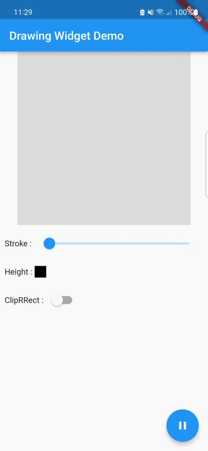

Light widget to make some drawing.




## Features

* Drawing & displaying mode.
* Change color.
* Change stroke value.
* Adaptative size.


## Usage

Change drawing property to ether start drawing or display a drawing.


```dart

final _drawing = Drawing(
  strokeColor: Colors.black,
  strokeValue: 2,
  isDrawing: true,
);

DrawingWidget(
 drawing: _drawing,
 onUpdate: (value) {
  // do some job if needed
 },
)
```

## Additional information

Don't hesitate to contribute or to contact me if needed.
